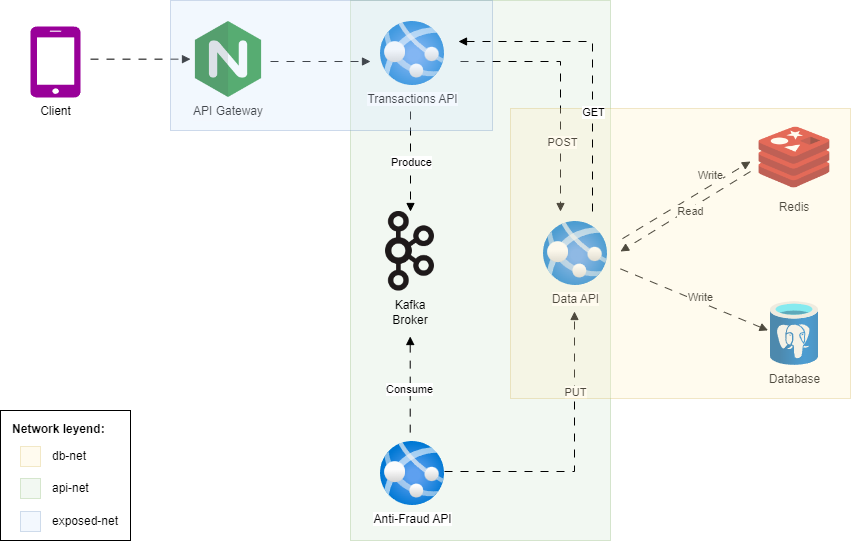

# Yape Code Challenge - Solution

This PR contains a proposed solution to the Yape Code Challenge. The solution is implemented using NestJS, TypeORM, PostgreSQL, Redis, Kafka, Nginx, GraphQL and Swagger.

# Architecture


# Implementation
I'm assuming  that Yape use a SQL database, so I don't proposed a NoSQL database like MongoDB.

Redis is used for cache and Kafka for message broker.

The Data API is the unique entry point to the data sources.

Nginx is used as a reverse proxy to route requests to the Transaction API. Also, implements a secure configurations of headers, following the OWASP recommendations.

To use the Transactions API, you must have a user and password (basic autentication). The user is `admin` and the password is `1234`.

# Running the solution

## Docker Compose
Just only run the following command:
```bash
docker-compose up
```

## Swagger
You can access the Swagger documentation at http://localhost:8080/api

## GraphQL
You can access the GraphQL playground at http://localhost:8080/graphql
